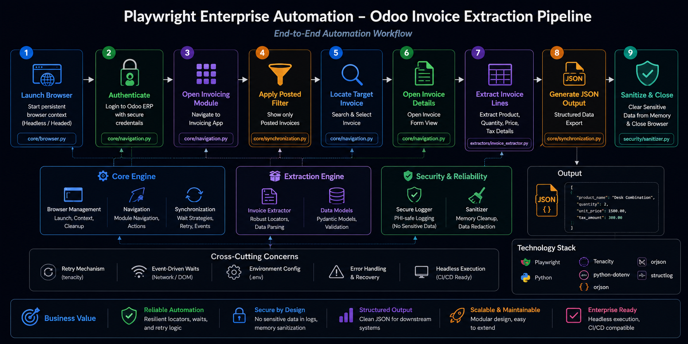
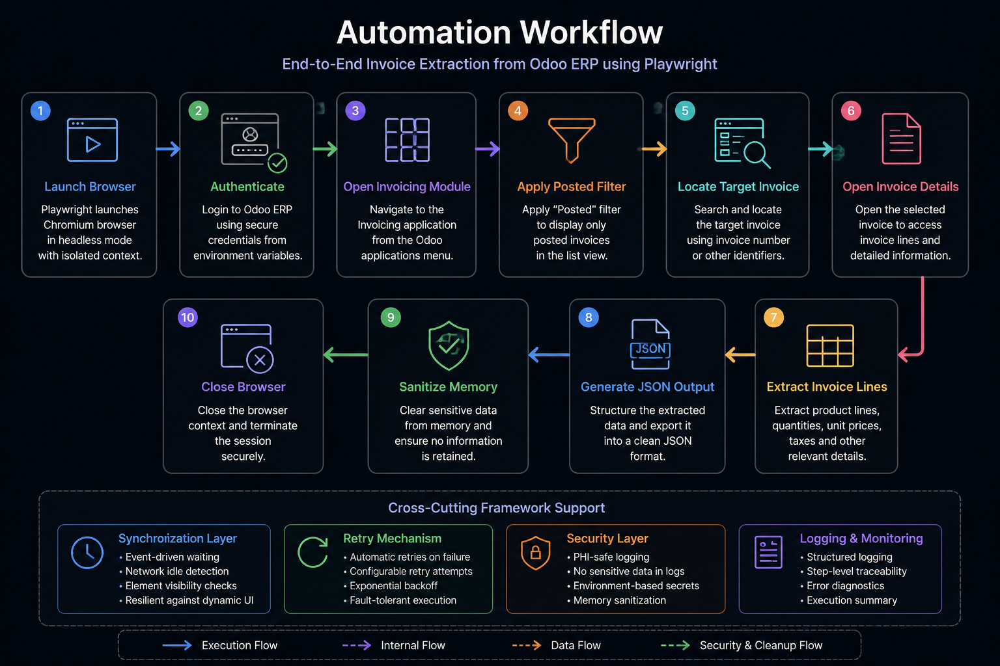
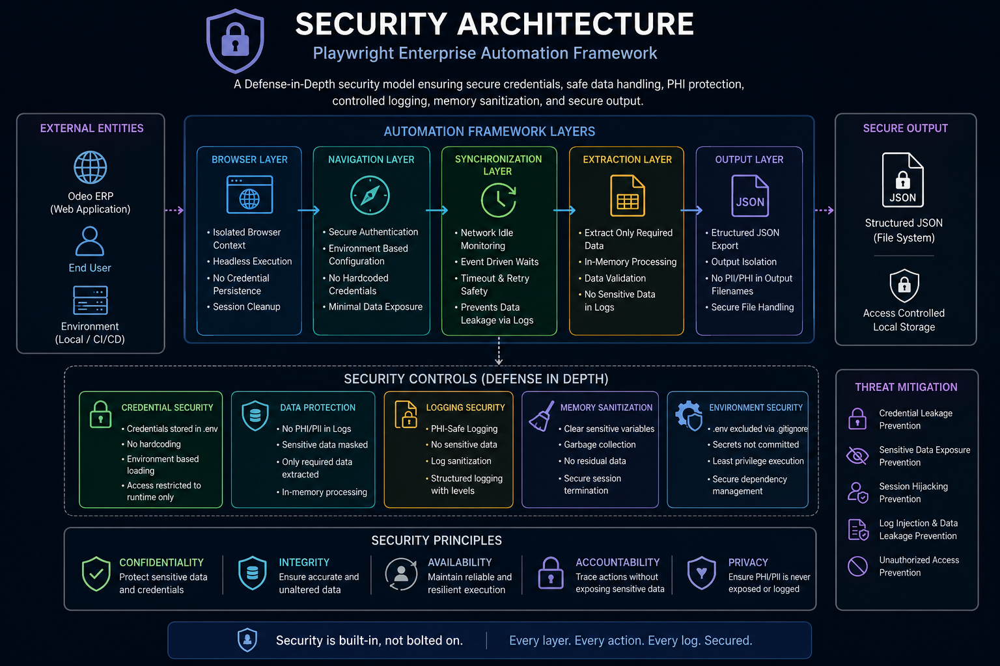

# Playwright Enterprise Automation


Enterprise-grade browser automation framework built with Playwright and Python for ERP invoice extraction, dynamic UI navigation, resilient synchronization, secure data processing, and structured JSON export.

<p align="center">
  
</p>

---

## Automation Workflow

<p align="center">
  
</p>

---

## Security Architecture

<p align="center">
  
</p>

---

## Overview

This project demonstrates a production-oriented automation workflow for interacting with dynamically rendered ERP systems.

The framework automates invoice discovery and extraction from an Odoo ERP environment while emphasizing:

* Dynamic UI handling
* Event-driven synchronization
* Resilient locator strategies
* Fault-tolerant automation
* PHI-safe logging
* Secure data processing
* Structured JSON export

---

## Business Scenario

Organizations often require automated extraction of invoice information from ERP systems for:

* Reporting
* Data migration
* Financial processing
* Auditing
* System integrations

This framework simulates a real-world enterprise workflow by locating a target invoice, extracting invoice line items, and exporting the results into a structured JSON format.

---

## Features

* Playwright-based browser automation
* Persistent browser sessions
* Dynamic ERP navigation
* Posted invoice filtering
* Invoice discovery workflow
* Invoice line extraction
* JSON export
* Retry mechanisms
* Event-driven synchronization
* Headless execution support
* Secure logging practices
* Memory sanitization
* Environment-based configuration

---

## Solution Architecture

The framework is organized into independent layers to improve maintainability, reliability, and extensibility.

### Browser Layer

Responsible for:

* Browser lifecycle management
* Context creation
* Session handling
* Headless execution

### Navigation Layer

Responsible for:

* Authentication
* ERP navigation
* Filter management
* Invoice discovery

### Synchronization Layer

Responsible for:

* Event-driven waiting
* Dynamic UI handling
* Network-aware synchronization
* Retry support

### Extraction Layer

Responsible for:

* Invoice line extraction
* Data validation
* JSON serialization

### Security Layer

Responsible for:

* PHI-safe logging
* Memory sanitization
* Secure credential handling
* Output isolation

---

## Automation Workflow

```text
Launch Browser
        │
        ▼
Authenticate
        │
        ▼
Open Invoicing Module
        │
        ▼
Apply Posted Filter
        │
        ▼
Locate Target Invoice
        │
        ▼
Open Invoice Details
        │
        ▼
Extract Invoice Lines
        │
        ▼
Generate JSON Output
        │
        ▼
Sanitize Memory
        │
        ▼
Close Browser
```

---

## Project Structure

```text
playwright-enterprise-automation/
│
├── assets/
│   └── architecture/
│
├── core/
│   ├── browser.py
│   ├── navigation.py
│   └── synchronization.py
│
├── extractors/
│   └── invoice_extractor.py
│
├── security/
│   ├── logger.py
│   └── sanitizer.py
│
├── docs/
│   ├── architecture.md
│   ├── workflow.md
│   ├── security.md
│   └── synchronization.md
│
├── output/
│
├── .env.example
├── requirements.txt
├── main.py
└── README.md
```

---

## Installation

```bash
git clone https://github.com/<your-username>/playwright-enterprise-automation.git

cd playwright-enterprise-automation

pip install -r requirements.txt

playwright install
```

---

## Configuration

Create a local `.env` file using `.env.example`.

```env
ODOO_URL=https://your-instance.odoo.com

ODOO_USERNAME=admin@example.com

ODOO_PASSWORD=change_me

HEADLESS=true

MAX_RETRIES=3

EXPORT_PATH=output/invoice_lines.json
```

---

## Documentation

Additional project documentation is available inside the `docs/` directory.

| Document           | Description                           |
| ------------------ | ------------------------------------- |
| architecture.md    | High-level solution architecture      |
| workflow.md        | End-to-end automation workflow        |
| security.md        | Security architecture and controls    |
| synchronization.md | Event-driven synchronization strategy |

---

## Expected Output

```json
[
  {
    "product_name": "Desk Combination",
    "quantity": 2,
    "unit_price": 1500.00,
    "tax_amount": 300.00
  }
]
```

---

## Security Considerations

* No invoice details exposed in logs
* No customer information written to console output
* Secure handling of extracted data
* Environment-based credential management
* Output isolation
* Memory sanitization after export
* PHI-safe logging practices

---

## Technology Stack

| Component      | Technology        |
| -------------- | ----------------- |
| Language       | Python            |
| Automation     | Playwright        |
| Browser Engine | Chromium          |
| Configuration  | Python Dotenv     |
| Retry Strategy | Tenacity          |
| Serialization  | JSON              |
| Logging        | Python Logging    |
| Execution      | Headless Chromium |

---

## Future Enhancements

* Multi-invoice extraction
* Session persistence
* API-assisted extraction
* Cloud execution support
* CI/CD integration
* Multi-ERP compatibility
* Advanced retry framework
* Screenshot-based diagnostics

---

## License

This project is licensed under the MIT License.
